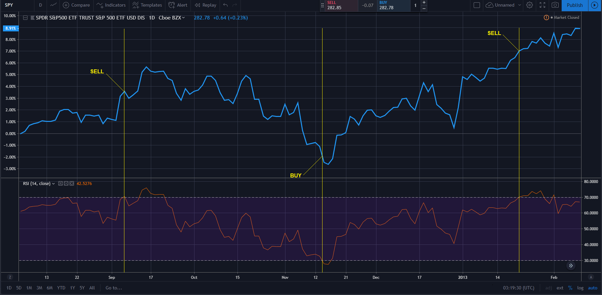
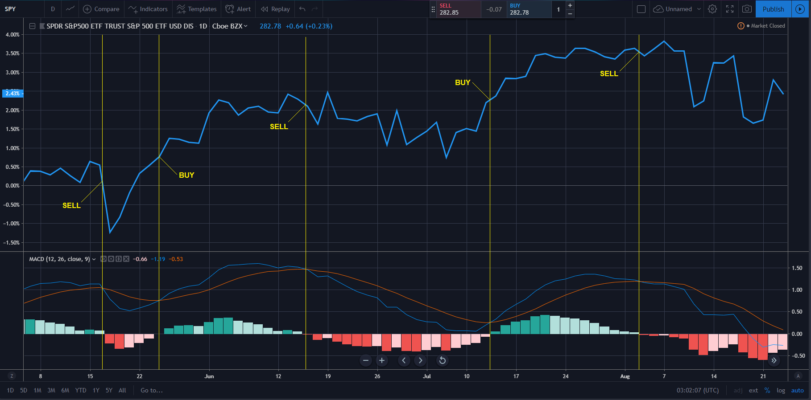

# Swing-Trading-Simulator

The idea of this small project is to simulate an active swing-trading strategy according to some technical indicators and see if it outperforms a passive buy-and-hold strategy using historical stock data from a RESTful API.

How it works: 
Given any valid ticker symbol, the program will fetch the historical prices for that stock (this includes RSI and MACD data) and trade the stock since inception according to the following criterias. 
(This API seems to have data starting ~1998).

Run 1 (RSI strategy): 
Buy when an oversold level (30) is reached and sell when overbought level (70) is reached.

Run 2 (MACD strategy): 
Buy when the MACD line crosses above the Signal line and sell when the opposite happens.

Results for ticker symbol SPY: 
(Spoiler alert: buying and holding destroy these "strategies") 
https://github.com/nicoqueijo/Swing-Trading-Simulator/blob/master/output/RSI.txt 
https://github.com/nicoqueijo/Swing-Trading-Simulator/blob/master/output/MACD.txt

